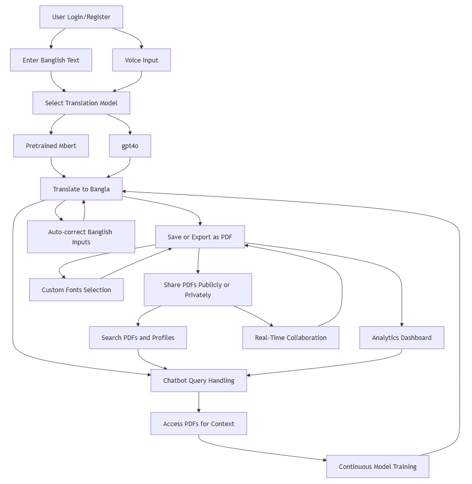
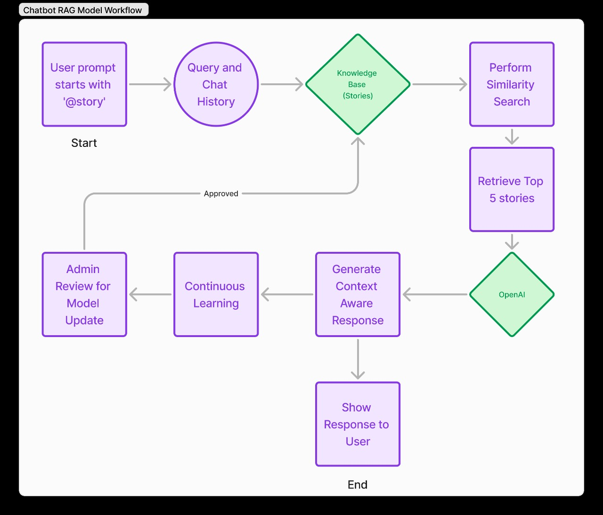

# KUET CSE BITFEST 2025 Hackathon

# Lekhoni: An AI-powered Banglish to Bangla Conversion App

## Table of Contents
1. [Project Overview](#overview)
2. [Features](#features)
3. [Technology Stack](#technology-stack)
4. [System Architecture](#system-architecture)
5. [Installation](#installation)
6. [Usage](#usage)
7. [Contributors](#contributors)
 
---

## Overview
This project is an innovative Banglish-to-Bangla conversion application designed to bridge the language gap by enabling seamless translations, chatbot interactions, and content creation in Bangla. It is equipped with advanced AI capabilities and continuous learning features to deliver precise translations and improve over time.

---

## Features
### Core Features
1. **Authentication**
   - Secure login and registration.
   - API protection for secure access.
2. **Banglish-to-Bangla Conversion**
   - Real-time high-accuracy translation using Pretrained Mbert model finetuned from ```facebook/mbart-large-50-many-to-many-mmt``` and ```OpenAI gpt4o``` model
3. **Content Management**
   - A custom Rich Text editor with voice input for writing and converting content.
   - Export as PDF (public/private options).
   - AI-generated titles and captions.
4. **Chatbot Integration**
   - Supports Banglish and Bangla inputs.
   - Context-aware responses based on saved content.
5. **Search Functionality**
   - App-wide search in both Banglish and Bangla.
6. **Continuous Learning**
   - Improves translation accuracy through verified user inputs.

### Bonus Features
- **Voice Interaction:** Hands-free text input and chatbot responses.
- **Smart Editor:** Auto-correct common typing errors.
- **Real-Time Collaboration:** Multi-user content editing.
- **Analytics Dashboard:** Tracking translation usage and chatbot interactions.
- **Customizable Bangla Fonts:** Personalize PDF outputs.
- **Dockerized Deployment:** Ensures scalable and consistent environments.

---

## Technology Stack
- **Frontend**:
  - Next.js 14 (App Directory)
  - Tailwind CSS (Styling)
  - Shadcn/UI (Component Library)
  - TypeScript

- **Backend**:
  - Python (FastAPI)
  - LangChain
  - PostgreSQL Database + LanceDB (Vector DB)
  - Next Auth (Authentication)

- **AI/ML Services**:
  - Pre-trained models (mBERT, GPT-4o)
  - OpenAI API
  - Custom LangChain Agents

- **External APIs & CDNs**:
  - Cloudinary (Image CDN)

- **Hosting:** Docker
- **Version Control:** Git & Github

---

## System Architecture
### Workflow Diagram


---

### RAG (Chatbot) Model Workflow Diagram


---

## Installation
### Prerequisites
- Node.js
- Python 3.8 or Higher
- Docker (optional)

### Steps
1. Clone the repository:
   ```bash
   git clone https://github.com/JHM69/Lekhoni.git
   ```
2. Navigate to the project directory:
   ```bash
   cd Lekhoni
   ```
3. Install dependencies:
   ```bash
   npm install
   ```
4. Install Python Server dependencies:
   ```bash
   pip install -r python-server/requirements.txt
   ```
5. Install Pretrained Model and it's dependencies:
   ```bash
   pip install -r pretained-model/requirements.txt
   ```
6. Set environment variables in `.env`.
7. Start the development server:
   ```bash
   npm run dev
   ```

---

## Usage
1. Register/Login into the app.
2. Input Banglish text in the editor or chatbot.
3. Convert text to Bangla and export as PDF.
4. Use the chatbot to ask questions and get responses.
5. Track analytics and customize settings.

---

## Contribution
Contributions are welcome! Please follow these steps:
1. Fork the repository.
2. Create a new branch:
   ```bash
   git checkout -b feature-name
   ```
3. Commit changes:
   ```bash
   git commit -m 'Add new feature'
   ```
4. Push to your branch:
   ```bash
   git push origin feature-name
   ```
5. Open a Pull Request.

---

## License
This project is licensed under the [MIT License](LICENSE).

---

## Contributors
- **Team Name:** Quantum Guys
- **Team Members:** [Jahangir Hossain](https://github.com/jhm69), [Md. Farhan Masud Shohag](https://github.com/fms-byte), [Muammar Tazwar Asfi](https://github.com/asfi50)